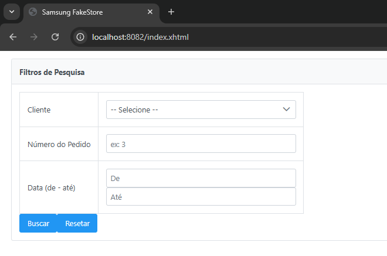
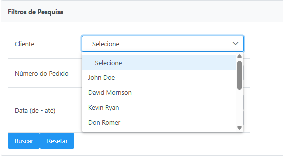
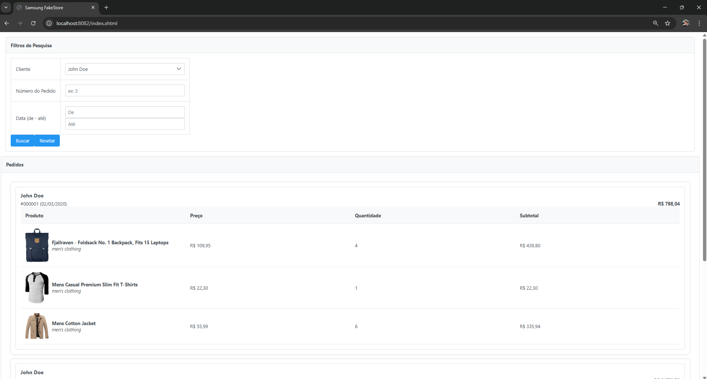
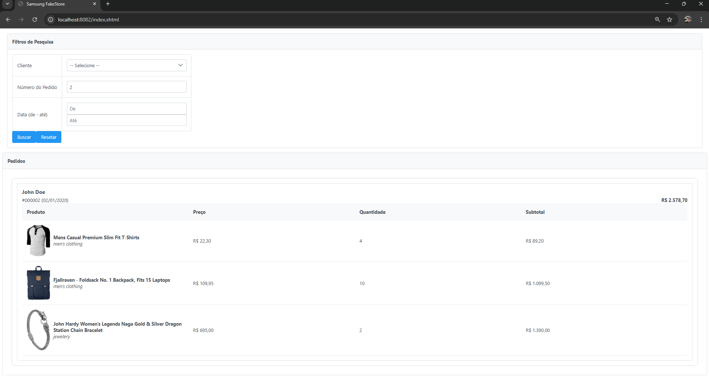
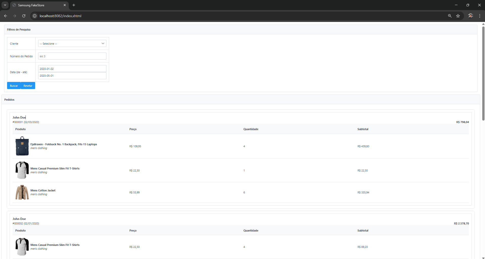

# Samsung Fakestore UI 🔹


Frontend da loja Samsung Fakestore, desenvolvido com **Spring Boot + PrimeFaces**.

**Desenvolvedor:** Gustavo Candido Pereira

---

## URL padrão

- [http://localhost:8082/index.xhtml](http://localhost:8082/index.xhtml)

---

## Funcionalidades
 
- Consulta de pedidos por cliente, número ou intervalo de datas  
- Visualização de detalhes de pedidos e produtos  

---

## Screenshots do Frontend

### Filtros de pesquisa


### Lista de clientes


### Filtro por cliente


### Filtro por pedido


### Filtro por período


---

## Rodar localmente

### Pela IDE
Execute a classe principal:

*com.samsung.fakestore.UiApplication*


### Pelo terminal com Maven
```
cd samsung-fakestore-ui
mvn spring-boot:run
```

### Pelo terminal via JAR (opcional)
```
mvn clean package
java -jar target/samsung-fakestore-ui-0.0.1-SNAPSHOT.jar
```


- O frontend roda direto pelo Spring Boot, não é necessário servidor externo.

---
 
### Configurações
Alterar porta no arquivo application.yml:

```
server:
  port: 8082
```

A porta padrão é 8082. Pode ser alterada conforme necessidade.

---

### Observações Técnicas
Consome endpoints do backend (http://localhost:8081/api)

Desenvolvido com Spring Boot + PrimeFaces

*Pode ser startado diretamente pela IDE ou pelo terminal*

*Backend e frontend podem rodar simultaneamente*
